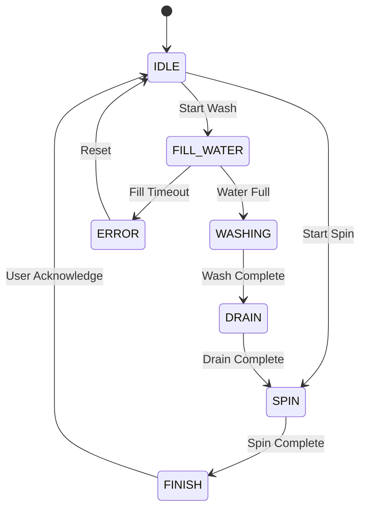

# Washing Machine Simulator - Project Specification

## 1. Project Goal

Build a washing machine simulator on STM32F411E-DISCO to learn FreeRTOS through a realistic embedded application.

The project should demonstrate practical usage of:

* Tasks
* Queues
* Event Groups
* Task Notifications
* Binary Semaphore
* Counting Semaphore
* Mutex
* Software Timers
* State Machines
* SEGGER SystemView

The focus is on understanding RTOS architecture and inter-task communication rather than building a commercial washing machine product.

---

# 2. Hardware Platform

## Board

STM32F411E-DISCO

## MCU

STM32F411VETx

* ARM Cortex-M4F
* 512 KB Flash
* 128 KB SRAM

## IDE

STM32CubeIDE

## RTOS

FreeRTOS

## Debug Tools

* ST-Link
* SEGGER RTT
* SEGGER SystemView
* Logic Analyzer

---

# 3. Hardware Configuration

## User Input

### B1 User Button

GPIO:

PA0

Functions:

Short Press:

* Change selection

Long Press (3 seconds):

* Confirm selection
* Start selected mode

---

## OLED Display

Interface:

I2C1

Recommended Pins:

SCL -> PB8

SDA -> PB9

OLED Handle Naming Convention:

Use:

hOled

instead of:

hi2c1

when passing the OLED I2C handle to OLED drivers.

---

## Simulation Outputs

### Motor

GPIO:

PD12

Board LED:

LD4 (Green)

Logic:

HIGH = Motor ON

LOW = Motor OFF

---

### Water Inlet Valve

GPIO:

PD13

Board LED:

LD3 (Orange)

Logic:

HIGH = Filling Water

LOW = Stop Filling

---

### Drain Valve

GPIO:

PD14

Board LED:

LD5 (Red)

Logic:

HIGH = Draining

LOW = Drain Complete

---

### System Status

GPIO:

PD15

Board LED:

LD6 (Blue)

Logic:

HIGH = Machine Running

LOW = Machine Idle

---

# 4. Washing Modes

## Wash Mode

Flow:

IDLE

→ FILL_WATER

→ WASHING

→ DRAIN

→ SPIN

→ FINISH

---

## Spin Mode

Flow:

IDLE

→ SPIN

→ FINISH

---

# 5. User Interface

OLED Main Screen:

Washing Machine

> Wash

Spin

Short Press:

* Move selection

OLED:

Washing Machine

Wash

> Spin

Long Press (3 seconds):

* Start selected mode

---

# 6. State Machine

States:

* IDLE
* FILL_WATER
* WASHING
* DRAIN
* SPIN
* FINISH
* ERROR

---

# 7. RTOS Architecture

Button ISR

↓

Button Queue

↓

UI Task

↓

Command Queue

↓

WashingManager Task

↑

Event Group

↑

Sensor Task

WashingManager

↓

Display Queue

↓

OLED Task

---

# 8. Task Design

## UI Task

Responsibilities:

* Process button events
* Menu navigation
* Mode selection
* Generate commands

Priority:

2

---

## WashingManager Task

Responsibilities:

* State machine execution
* System coordination
* Motor control
* Valve control

Priority:

3

Notes:

WashingManager is the owner of all machine states.

---

## Sensor Task

Responsibilities:

* Monitor door sensor
* Monitor water level sensor
* Update event bits

Priority:

2

Period:

100 ms

---

## OLED Task

Responsibilities:

* OLED rendering
* Display system status

Priority:

1

Notes:

OLEDTask is the only task allowed to access the OLED driver.

---

# 9. RTOS Objects

## Queues

### Button Queue

Producer:

Button ISR

Consumer:

UI Task

Purpose:

Transfer button events from ISR to task context.

---

### Command Queue

Producer:

UI Task

Consumer:

WashingManager Task

Purpose:

Transfer user commands.

---

### Display Queue

Producer:

WashingManager Task

Consumer:

OLED Task

Purpose:

Transfer display updates.

---

## Event Group

Event Bits:

EVT_DOOR_CLOSED

EVT_WATER_FULL

EVT_TIMEOUT

EVT_FINISHED

EVT_ERROR

Purpose:

System synchronization.

---

## Software Timers

Wash Timer

Purpose:

Control washing duration.

Spin Timer

Purpose:

Control spinning duration.

---

## Mutex

Future Usage:

* OLED protection
* UART debug protection
* Shared resource protection

---

# 10. Simulation Timing

Fill Water:

10 seconds

Wash:

20 seconds

Drain:

5 seconds

Spin:

10 seconds

These values are configurable and may be adjusted during development.

---

# 11. Hardware Verification

The project shall be verifiable using:

* On-board LEDs
* Logic Analyzer
* SEGGER SystemView

## Logic Analyzer Connections

CH0 -> PD12 (Motor)

CH1 -> PD13 (Inlet Valve)

CH2 -> PD14 (Drain Valve)

CH3 -> PD15 (System Status)

GND -> Board GND

---

## Expected Wash Sequence

Step 1

PD13 HIGH

Duration:

10 seconds

Meaning:

Filling Water

---

Step 2

PD12 HIGH

Duration:

20 seconds

Meaning:

Washing

---

Step 3

PD14 HIGH

Duration:

5 seconds

Meaning:

Draining

---

Step 4

PD14 LOW, PD12 HIGH

Duration:

10 seconds

Meaning:

Spinning

---

Step 5

PD12 LOW

PD13 LOW

PD14 LOW

Meaning:

Finished

---

## Expected Spin Sequence

Step 1

PD12 HIGH

Duration:

10 seconds

Meaning:

Spinning

---

Step 2

PD12 LOW

Meaning:

Finished

---

# 12. Error Handling

## Door Open

Condition:

Door opened while machine is running.

Action:

Transition to ERROR state.

---

## Water Fill Timeout

Condition:

Water level not detected within allowed time.

Action:

Transition to ERROR state.

---

# 13. Design Rules

1. WashingManager owns all system states.
2. OLEDTask owns all OLED access.
3. Drivers must not depend on FreeRTOS.
4. BSP hides HAL from application code.
5. Keep ISR execution short.
6. Use Queue for commands and messages.
7. Use Event Groups for status synchronization.
8. Use Task Notifications for lightweight wake-up events.
9. Avoid blocking operations inside ISR.
10. Explain FreeRTOS APIs before introducing them.

---

# 14. Future Extensions

* UART Debug Task
* Logging System
* EEPROM Emulation
* Watchdog Integration
* CPU Load Measurement
* Stack Usage Analysis
* Event-Driven Architecture
* CLI Interface
* SD Card Logging

---

# 15. Development Roadmap

Phase 1

* Project Setup
* Folder Structure
* FreeRTOS Configuration

Phase 2

* Application Data Types
* Queue Design
* Event Group Design

Phase 3

* UI Task

Phase 4

* Sensor Task

Phase 5

* WashingManager State Machine

Phase 6

* OLED Integration

Phase 7

* Software Timers

Phase 8

* SystemView Analysis

Phase 9

* CPU Load Measurement

Phase 10

* Advanced Features
