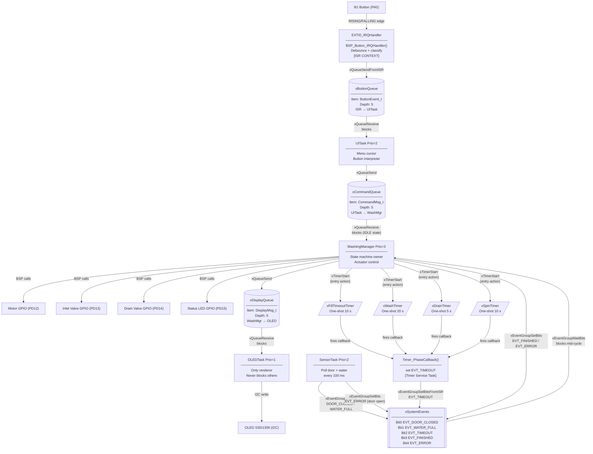
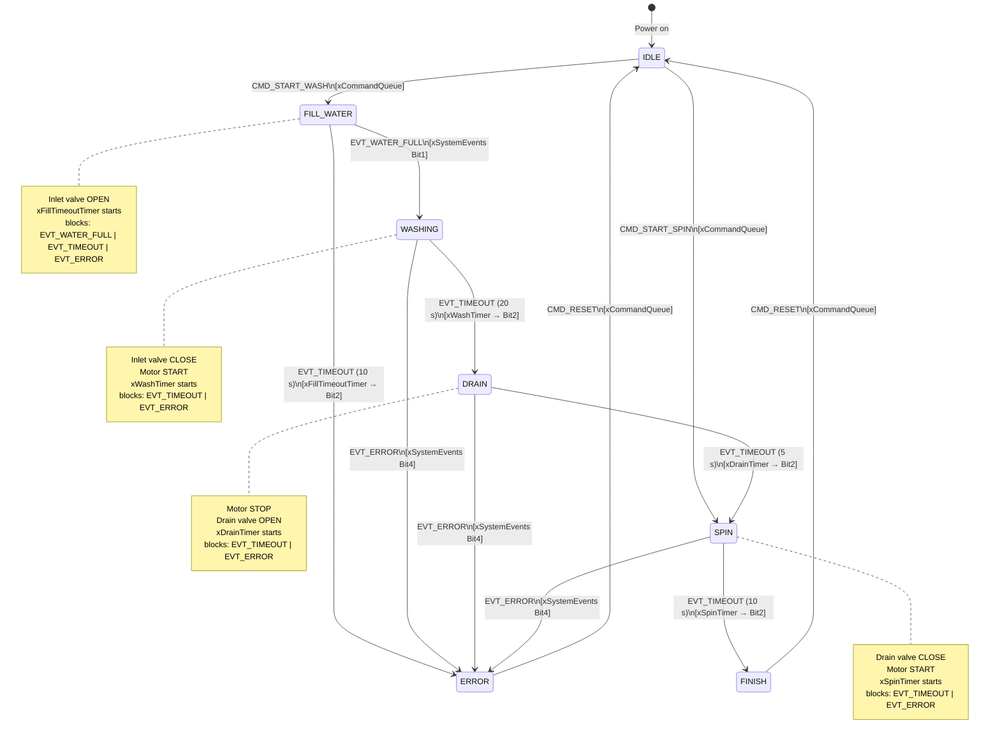
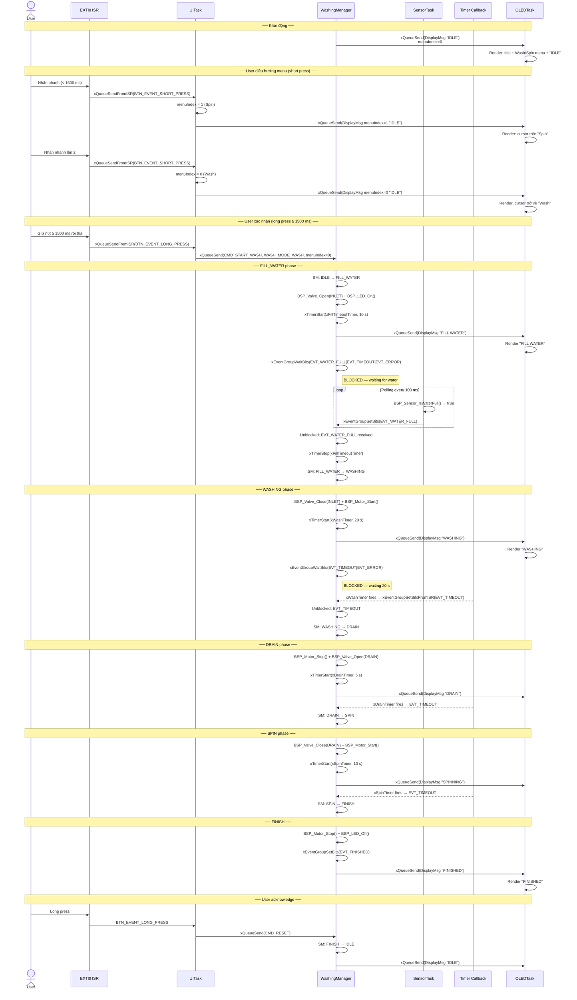
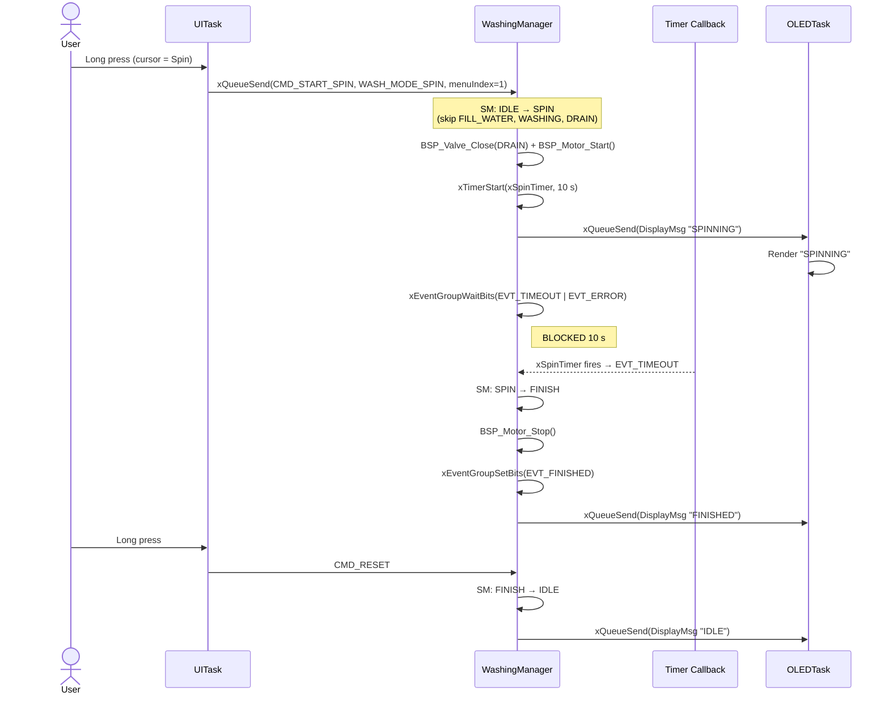
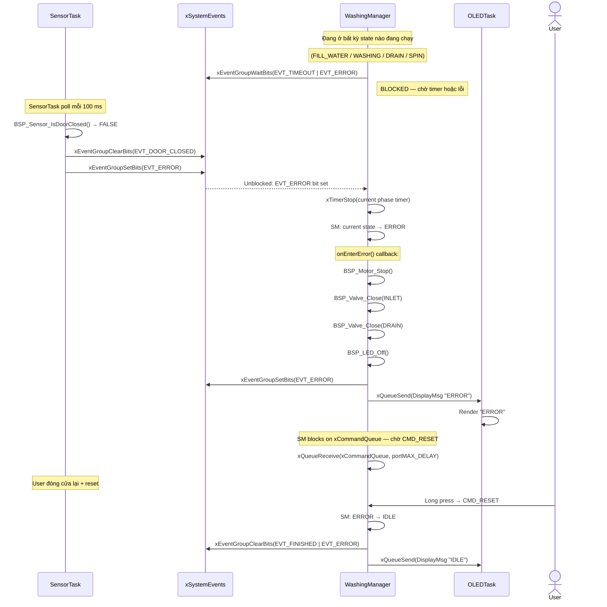
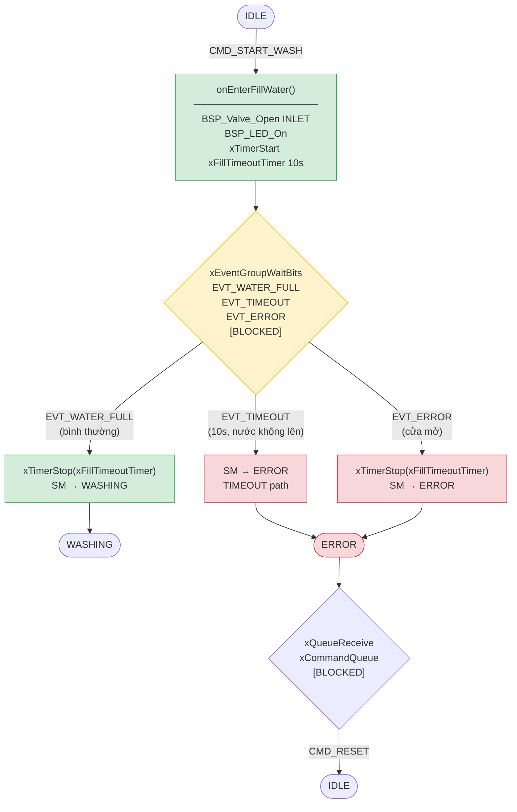
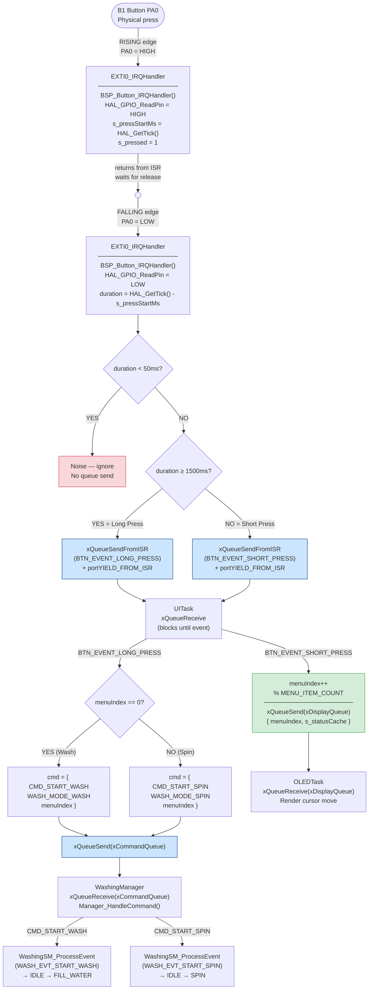
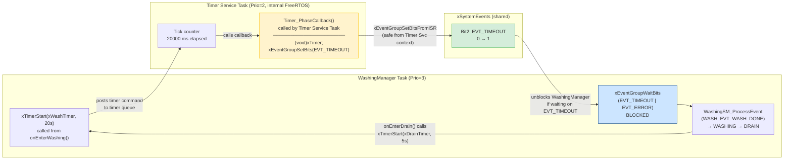
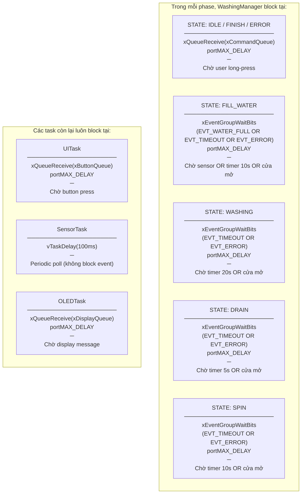

# Washing Machine Simulator — Visual Reference

> Đọc file này để nắm nhanh toàn bộ luồng hoạt động của project.
> Mỗi sơ đồ tập trung vào một khía cạnh cụ thể để dễ debug.

---

## 1. Kiến trúc tổng thể — Tasks & Communication Objects

Mô tả: **Ai** giao tiếp với **ai** thông qua **cơ chế nào**.



---

## 2. State Machine — Tất cả trạng thái và chuyển tiếp



---

## 3. Kịch bản A — Full Wash Cycle (Bình thường)

**Trigger:** User long-press button khi cursor ở "Wash"



---

## 4. Kịch bản B — Spin-Only Cycle

**Trigger:** User long-press khi cursor ở "Spin"



---

## 5. Kịch bản C — Error: Cửa Mở Giữa Chu Trình

**Trigger:** SensorTask phát hiện cửa mở khi đang chạy



---

## 6. Kịch bản D — Fill Timeout (Nước Không Lên)

**Trigger:** Nước không đạt mức trong 10 giây



---

## 7. Button Press Flow — Từ Phần Cứng Đến State Machine



---

## 8. Software Timer Flow — Cách Timer Lái State Machine



---

## 9. Task Blocking Map — Mỗi Task Đang Chờ Gì

Bảng này dùng để debug: nếu chương trình treo, xem task nào đang block và tại sao.



**Debug tip:** Nếu màn hình không update → OLEDTask đang chờ message ở xDisplayQueue. Kiểm tra WashingManager có gọi `Manager_PostDisplay()` không.

**Debug tip:** Nếu machine không start khi long-press → WashingManager đang block đúng chỗ không? Dùng SEGGER SystemView xem task state.

---

## 10. OLED Screen Layout

```
Pixel coordinates: x=0..127 (left→right), y=0..63 (top→bottom)
Font: 6×8 px per character → 21 chars/row, 8 rows max

┌────────────────────────────────────────────┐  y=0
│ Washing Machine                            │  Row 0 (y pixel 0–7)
├────────────────────────────────────────────┤  y=8
│ > Wash    ← menuIndex == 0                 │  Row 1 (y pixel 8–15)
│   Wash    ← menuIndex != 0                 │
├────────────────────────────────────────────┤  y=16
│ > Spin    ← menuIndex == 1                 │  Row 2 (y pixel 16–23)
│   Spin    ← menuIndex != 1                 │
├────────────────────────────────────────────┤  y=24
│ IDLE / FILL WATER / WASHING /              │  Row 3 (y pixel 24–31)
│ DRAIN / SPINNING / FINISHED / ERROR        │
├────────────────────────────────────────────┤  y=32
│ (empty — always black)                     │  Rows 4–7 (y pixel 32–63)
└────────────────────────────────────────────┘  y=63

Owner phân quyền:
  Row 0: hardcoded trong oled_task.c
  Row 1–2: menuIndex từ DisplayMsg_t (owner: UITask → truyền qua CommandMsg_t)
  Row 3: statusText từ DisplayMsg_t (owner: WashingManager)
```

---

## 11. FreeRTOS Object Summary

| Object | Type | Depth/Bits | Producer | Consumer | Mechanism |
|--------|------|-----------|----------|----------|-----------|
| `xButtonQueue` | Queue | 5 items | ISR (EXTI0) | UITask | `xQueueSendFromISR` / `xQueueReceive` |
| `xCommandQueue` | Queue | 5 items | UITask | WashingManager | `xQueueSend` / `xQueueReceive` |
| `xDisplayQueue` | Queue | 5 items | WashingManager, UITask | OLEDTask | `xQueueSend` / `xQueueReceive` |
| `xSystemEvents` | Event Group | 5 bits | SensorTask, TimerCb, WashMgr | WashingManager | `xEventGroupSetBits` / `xEventGroupWaitBits` |
| `xFillTimeoutTimer` | SW Timer | One-shot 10 s | WashingManager | TimerServiceTask | `xTimerStart` / callback |
| `xWashTimer` | SW Timer | One-shot 20 s | WashingManager | TimerServiceTask | `xTimerStart` / callback |
| `xDrainTimer` | SW Timer | One-shot 5 s | WashingManager | TimerServiceTask | `xTimerStart` / callback |
| `xSpinTimer` | SW Timer | One-shot 10 s | WashingManager | TimerServiceTask | `xTimerStart` / callback |

**Không có Mutex/Semaphore trong project hiện tại:**
- OLED access: chỉ có OLEDTask mới gọi BSP_OLED_* → không cần mutex
- State machine: chỉ có WashingManager mới gọi WashingSM_* → không cần mutex
- Sensor data: SensorTask write, WashingManager read qua Event Group (atomic) → không cần mutex
